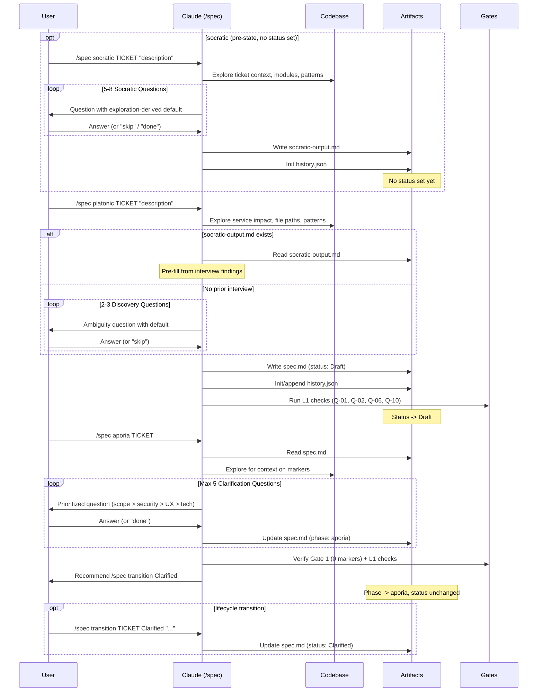
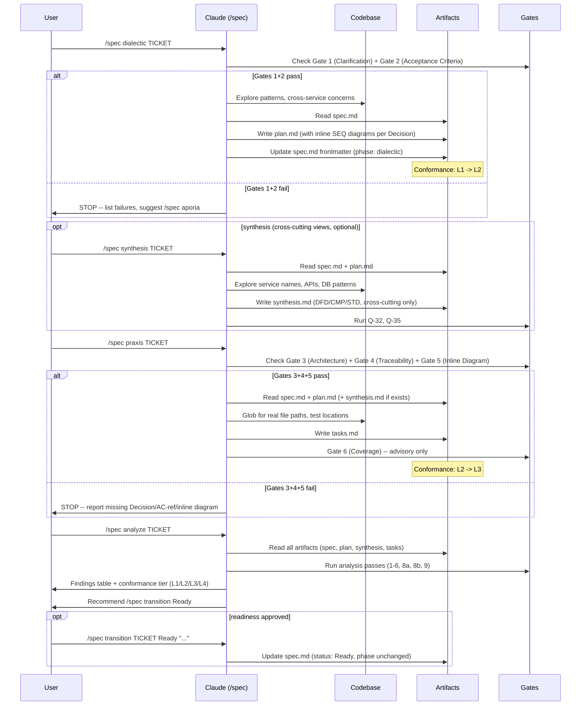
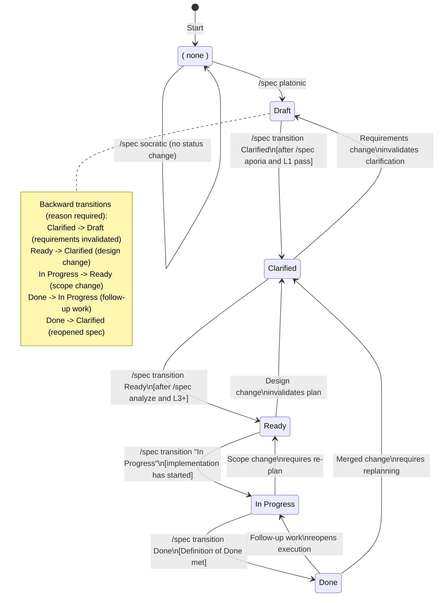
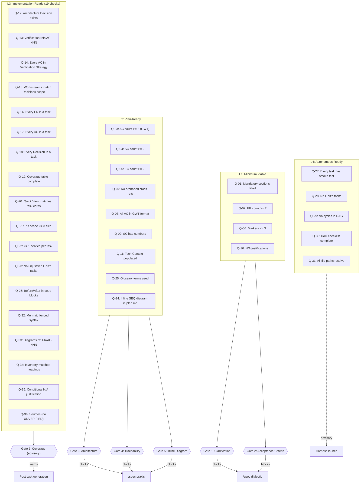
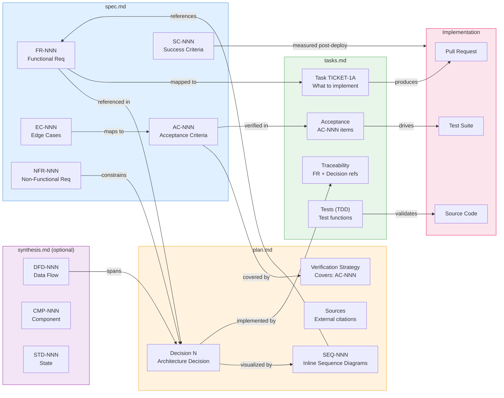
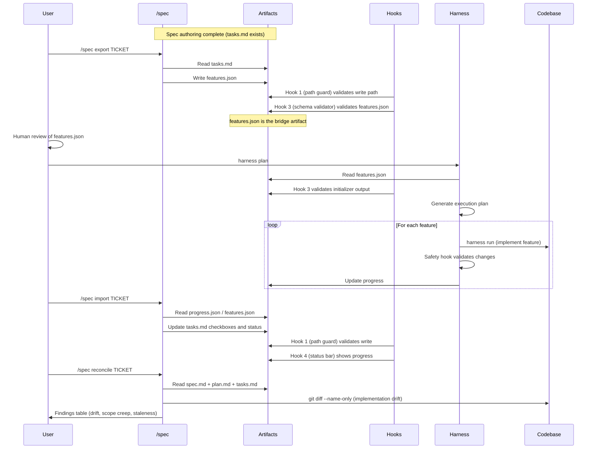

# SDD Workflow Visual Guide

The Spec-Design-Deliver (SDD) workflow turns a feature idea into a fully traceable, PR-sized task breakdown. It uses `/spec` sub-commands to move a specification through a gated state machine -- from socratic inquiry to implementation-ready tasks -- with conformance tiers (L1-L4) ensuring quality at each stage.

The philosophical arc: **socratic → platonic → aporia → dialectic → synthesis → praxis**

For authoritative references, see:

-   [`references/lifecycle-model.md`](references/lifecycle-model.md) for lifecycle ownership and transitions
-   [`SKILL.md`](SKILL.md) for command workflows, gates, and artifact generation

## Quick Start

```bash
# 1. (Optional) Deep discovery interview
/spec socratic FROSTY-147 "DB query optimization"

# 2. Scaffold the spec (the platonic ideal)
/spec platonic FROSTY-147 "DB query optimization"

# 3. Resolve ambiguities and explicitly mark the spec Clarified
/spec aporia FROSTY-147
/spec transition FROSTY-147 Clarified "All clarification markers resolved"

# 4. Generate implementation plan with inline architecture diagrams
/spec dialectic FROSTY-147

# 5. (Optional) Generate cross-cutting system-level diagrams
/spec synthesis FROSTY-147

# 6. Decompose into PR-sized tasks
/spec praxis FROSTY-147

# 7. Verify readiness and explicitly mark the spec Ready
/spec analyze FROSTY-147
/spec transition FROSTY-147 Ready "analyze reported 0 CRITICAL findings and L3+ readiness"

# 8. Export to harness
/spec export FROSTY-147
```

## Decision Guide

| I want to... | Use | Prerequisites | | ------------------------------------- | ------------------- | ---------------------------------------------------- | | Explore requirements before writing | `/spec socratic` | None | | Create a new spec from scratch | `/spec platonic` | None (`socratic-output.md` is optional) | | Resolve `[NEEDS CLARIFICATION]` items | `/spec aporia` | `spec.md` exists | | Explicitly change lifecycle status | `/spec transition` | `spec.md` exists and the transition guard passes | | Generate an implementation plan | `/spec dialectic` | Gate 1 + Gate 2 pass | | Generate cross-cutting diagrams | `/spec synthesis` | `plan.md` exists (optional stage) | | Break plan into PR-sized tasks | `/spec praxis` | Gate 3 + Gate 4 + Gate 5 pass | | Check cross-artifact consistency |
`/spec analyze` | `spec.md` exists (partial sets OK) | | See all specs and their status | `/spec status` | None | | Export tasks to harness JSON | `/spec export` | `tasks.md` exists | | Import harness progress back | `/spec import` | `features.json` / `progress.json` exists | | Detect drift between spec and code | `/spec reconcile` | `spec.md` + `plan.md` + `tasks.md` exist |

## Diagram 1a: Spec Authoring Sequence

Socratic, platonic, and aporia -- the authoring phase that produces `spec.md`.



## Diagram 1b: Dialectic-to-Praxis Sequence

Dialectic, synthesis, praxis, and analyze -- the design phase that produces implementation artifacts.



## Diagram 2: State Machine

Lifecycle states with guarded forward and backward transitions.



## Diagram 3: Gates and Conformance Tiers

How the 6 compliance gates map to conformance tiers and which workflow stages they block.



## Diagram 4: Traceability Chain

How identifiers flow across artifacts from spec through to implementation.



## Diagram 5: Implementation Bridge

How `/spec export` connects to the harness execution loop and `/spec import` reconciles.



### Hook Firing Sequence

From [`hooks-skills-integration.md`](hooks-skills-integration.md) lines 89-101:

| Command | Hooks fired | | ------------------ | ----------------------------------------------------- | | `/spec platonic` | Hook 1 (path guard), Hook 2 (history), Hook 4 | | `/spec aporia` | Hook 1, Hook 2, Hook 4 | | `/spec dialectic` | Hook 1, Hook 2, Hook 4 | | `/spec synthesis` | Hook 1, Hook 2, Hook 4 | | `/spec praxis` | Hook 1, Hook 2, Hook 4 | | `/spec transition` | Hook 1, Hook 2, Hook 4 | | `/spec analyze` | (read-only, no hooks fire) | | `/spec export` | Hook 1, Hook 2, **Hook 3** (features.json validation) | | `/spec import` | Hook 1, Hook 2, Hook 4 | | `/spec reconcile` | (read-only, no hooks fire) |

## Artifact Inventory

| Artifact | Created by | Required? | Key contents | | -------------------- | ------------- | --------- | --------------------------------------------------------------- | | `socratic-output.md` | `socratic` | No | Q&A transcript, synthesized FR/AC/SC/EC/NFR drafts | | `spec.md` | `platonic` | Yes | Requirements, AC (GWT), SC, EC, NFRs, Service Impact | | `plan.md` | `dialectic` | Yes | Architecture Decisions + inline SEQ diagrams, Verification Strategy | | `synthesis.md` | `synthesis` | Optional | Cross-cutting diagrams (DFD/CMP/STD) for multi-service changes | | `tasks.md` | `praxis` | Yes | PR-sized task cards, dependency graph, coverage validation | | `features.json` | `export` | No | Harness-compatible task list (bridge artifact) | | `history.json` | First command | Yes | Structured
event log of all sub-command invocations |

All artifacts live in `specs/{TICKET}-{slug}/`.

## Cross-References

-   **Authoritative workflow**: [`skills/spec/SKILL.md`](../skills/spec/SKILL.md) -- state machine, gates, all sub-commands
-   **Quality checklist**: [`skills/spec/references/quality-checklist.md`](../skills/spec/references/quality-checklist.md) -- conformance tiers L1-L4 and check IDs Q-01 through Q-36
-   **Analysis rules**: [`skills/spec/references/analysis-rules.md`](../skills/spec/references/analysis-rules.md) -- 9 analysis passes (Passes 1-6, 7 reconciliation, 8a inline diagrams, 8b cross-cutting diagrams, 9 citations)
-   **Defaults**: [`skills/spec/references/defaults.yaml`](../skills/spec/references/defaults.yaml) -- tunables (overridden by `specs/.specrc.yaml`)
-   **Hooks integration**: [`docs/hooks-skills-integration.md`](hooks-skills-integration.md) -- hook firing sequence, spec-to-harness pipeline
