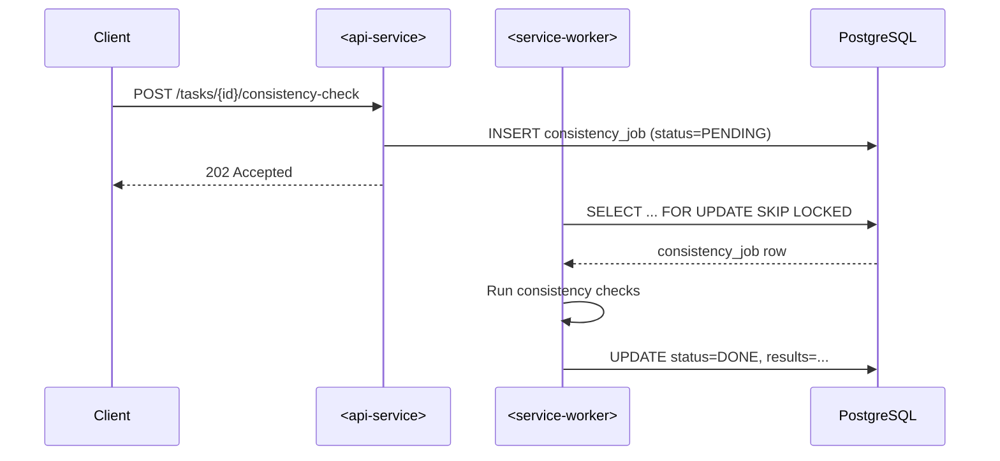
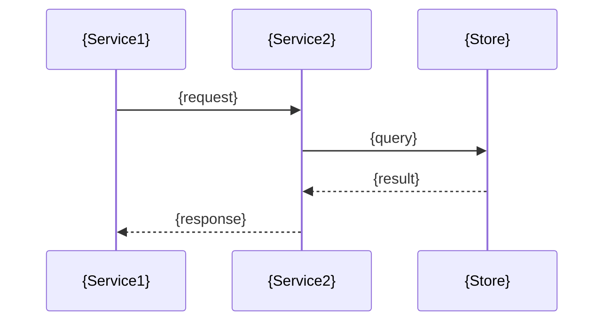

# Implementation Plan: $1

<!-- HOW and DECISIONS. No imperative implementation code. SQL migrations are OK (declarative). -->

## Summary

<!-- One paragraph: what this plan delivers and the high-level approach. -->

## Technical Context _(mandatory)_

<!-- WHAT: Structured record of codebase exploration findings.
     Fill all fields. Variable elements (which pyworker, which queue) MUST be explicit.
     WHEN TO OMIT: Never.
     EXAMPLE: Affected Services = <service-worker>, <shared-lib> -->

| Dimension               | Value                                            |
| ----------------------- | ------------------------------------------------ |
| **Primary Languages**   | TypeScript, Python                               |
| **Affected Services**   | <!-- from spec Service Impact table -->          |
| **DB Changes Required** | Yes / No                                         |
| **Migration Required**  | Yes / No                                         |
| **Key DB Tables**       | <!-- e.g., task, segment, translation_memory --> |
| **Performance Targets** | <!-- from spec NFR-NNN -->                       |
| **Rollback Strategy**   | <!-- how to revert if deployment fails -->       |

## Architecture Decisions

<!-- Repeat this section for each significant decision. Mirrors the ADR pattern from playbook/patterns/. -->

### Decision 1: {Title}

**Context**: <!-- Why does this decision need to be made? -->

**Decision**: <!-- What was decided. -->

| Alternative | Pros | Cons |
| ----------- | ---- | ---- |
| {chosen}    | ...  | ...  |
| {rejected}  | ...  | ...  |

**Rationale**: <!-- Why this alternative was chosen over others. -->

**Sources**: <!-- URLs for verifiable external claims. Omit if decision is purely internal codebase logic. WHEN REQUIRED: Decision makes claims about external behavior a developer cannot verify by reading the repo (tool behavior, protocol semantics, library capabilities, industry practices). WHEN TO OMIT: Decision is about internal code organization, naming, or repo-specific patterns. FORMAT: Numbered list with [description](URL). EXAMPLE: 1. [Node.js - process signal events](https://nodejs.org/api/process.html#signal-events) 2. [Docker best practices: ENTRYPOINT](https://docs.docker.com/develop/develop-images/dockerfile_best-practices/#entrypoint) UNVERIFIED: If a claim could not be sourced: "[UNVERIFIED] npm signal forwarding -- no authoritative source found" -->

**Diagram**: <!-- Inline Mermaid sequence diagram showing the interaction pattern for this specific decision. Required for decisions involving service-to-service communication. Use SEQ-NNN ID convention with FR/AC references. WHEN TO OMIT: When the decision is about internal code organization, naming, or configuration — no service interaction to visualize. Write "N/A — internal decision, no service interaction." EXAMPLE:

#### SEQ-001: Consistency check flow (FR-001, AC-001)



**Narrative**: The client triggers a consistency check via the API, which queues the job in PostgreSQL. The pyworker polls for pending jobs using SKIP LOCKED and processes them asynchronously.

-->

#### SEQ-{NNN}: {Title} ({FR-NNN}, {AC-NNN})



**Narrative**: <!-- 2-3 sentences explaining the flow in plain language. -->

<!-- Add more decisions as needed: ### Decision 2: ... -->

## Decision Diagram Inventory

<!-- WHAT: Summary table of all inline diagrams within Architecture Decisions.
     WHY: Quick reference and traceability. Row count must match inline diagram headings.
     The /spec analyze command validates this table against actual diagram headings in plan.md. -->

| ID      | Decision   | Title   | References     |
| ------- | ---------- | ------- | -------------- |
| SEQ-001 | Decision 1 | {Title} | FR-001, AC-001 |

## Industry Precedent _(include only when the approach mirrors known patterns from other systems)_

<!-- WHAT: External systems or well-known projects that use a similar approach.
     WHY: Validates the design by showing prior art; builds reviewer confidence.
     WHEN TO OMIT: Never silently delete. If not applicable, replace content with:
     "N/A -- no known external prior art identified."
     FORMAT: Each bullet MUST include a URL to the project/doc/article referenced.
     Use WebFetch to verify the URL resolves and extract a confirming detail.
     EXAMPLE:
     - **Temporal.io**: Uses lease-based heartbeats for activity task ownership (similar to our DB lease pattern). [Temporal - Activity Heartbeats](https://docs.temporal.io/activities#activity-heartbeat)
     - **Kafka Consumer Groups**: Rebalancing protocol mirrors our SKIP LOCKED polling approach. [Kafka Consumer Design](https://kafka.apache.org/documentation/#design_consumerposition)
     - **AWS Step Functions**: State machine transitions with exactly-once delivery guarantees. [Step Functions Concepts](https://docs.aws.amazon.com/step-functions/latest/dg/concepts-standard-vs-express.html) -->

-   ...

## Cross-Service Concerns

<!-- How does this change propagate across the monorepo? -->

| Concern          | TypeScript Services                                    | Python Services                             | Shared                                    |
| ---------------- | ------------------------------------------------------ | ------------------------------------------- | ----------------------------------------- |
| Types/Interfaces | <!-- e.g., "Add ConsistencyResult to <shared-lib>" --> | <!-- e.g., "Add to <shared-lib> models" --> | <!-- e.g., "DB migration adds column" --> |
| DB Access        |                                                        |                                             |                                           |
| Config           |                                                        |                                             |                                           |
| Testing          |                                                        |                                             |                                           |

## Existing Patterns Referenced

<!-- Link to playbook/patterns/ docs that this plan builds on. Encourages reuse. -->

-   [Pattern: ...](../../playbook/patterns/...)

## Schema Changes

<!-- Only if applicable. Exact SQL migration draft. Otherwise delete this section. -->

```sql
-- Migration: NNNN_{ticket}_{description}.sql
-- Direction: UP

ALTER TABLE ...;
```

## Implementation Approach

<!-- WHAT: High-level workstreams. tasks.md is the authoritative source for task details.
     This table provides the OUTLINE; do not duplicate task-level detail here.
     If workstreams change during task generation, UPDATE THIS TABLE. -->

| Workstream | Scope | Size  | Notes                   |
| ---------- | ----- | ----- | ----------------------- |
| 1          | ...   | S/M/L |                         |
| 2          | ...   | S/M/L | Depends on Workstream 1 |

## Before/After Visualization _(include only when the change modifies observable system behavior)_

<!-- WHAT: ASCII diagrams showing the system before and after the change.
     WHY: Makes the impact tangible -- reviewers can instantly see what changes.
     WHEN TO OMIT: Never silently delete. If not applicable, replace content with:
     "N/A -- change is internal; no observable behavior difference."
     FORMAT: Fenced code blocks with `text` language tag. Show before state, then after state.
     EXAMPLE:

     ### Before
     ```text
     Worker ──poll──> DB ──row──> Worker ──process──> DB
                                    (no timeout)
     ```

     ### After
     ```text
     Worker ──poll──> DB ──row+lease──> Worker ──heartbeat──> DB
                                           │                    │
                                           └──expired?──> DB reclaims row
     ``` -->

## Risk Assessment

| Risk | Likelihood   | Impact       | Mitigation |
| ---- | ------------ | ------------ | ---------- |
| ...  | Low/Med/High | Low/Med/High | ...        |

## Verification Strategy _(mandatory)_

<!-- WHAT: How we prove this works. EVERY AC-NNN from spec MUST appear in at least one row.
     Uncovered ACs block task generation (traceability gate).
     WHEN TO OMIT: Never.
     EXAMPLE: "Unit test | Automated | AC-001, AC-002 | pytest test_consistency.py" -->

| Method              | Type        | Covers         | Details |
| ------------------- | ----------- | -------------- | ------- |
| Unit test           | Automated   | AC-001, AC-002 | ...     |
| Integration test    | Automated   | AC-003         | ...     |
| Manual verification | Manual      | AC-004         | ...     |
| Observability check | Operational | NFR-001        | ...     |
